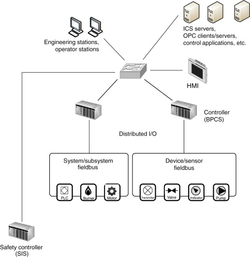

# 1. Seznamte se s protokoly pro ICS komunikaci a po dohodě s vedoucí vyberte protokol (protokoly), na který se zaměříte.

## ICS

Termín `Industrial control system (ICS)` souhrně označuje různé typy řídících systémů a prostředky pro jejich realizaci. Architektura a velikost řídícího systému je ovlivněna cílovou průmyslovou oblastí a způsobem využití daného systému.




**Zdroje:**  
[trendmicro.com](https://www.trendmicro.com/vinfo/us/security/definition/industrial-control-system/)  
[wikipedia.org](https://en.wikipedia.org/wiki/Industrial_control_system)  
[nist.gov](https://csrc.nist.gov/publications/detail/sp/800-82/rev-2/final) - dobrý pro základní popis (kapitola 2.1)  
[sciencedirect.com](https://www.sciencedirect.com/topics/computer-science/industrial-control-system) - obrázek

**Citace:**
```
KNAPP, Eric a Joel LANGILL. Industrial Network Security: Securing Critical Infrastructure Networks for Smart Grid, SCADA, and Other Industrial Control Systems. 2nd Edition. 2014. ISBN 9780124201149. Dostupné také z: https://www.elsevier.com/books/T/A/9780124201149
```

## IEC 104
`IEC 104`, přesněji `IEC 60870-5-104`, je protokol, kterým se zabývá tato bakalářská práce. Protokol poskytuje prostředky pro odesílání základních řídích zpráv mezi zařízeními v systémech pro správu elektrické přenosové soustavy.

Typická komunikace se skládá z centrální kontrolní stanice (také označována jako *master*) a několika *slave* stanic.
Master komunikuje zároveň vždy jen s jednou slave stanicí.
Využívá se pevného stáleho spojení.

- **Balanced:** Každá stanice může iniciovat komunikaci. Stanice jsou zároven master i slave.  
- **Unbalanced:** Master sekvenčně kontroluje slavy. Slaves pouze odpovídají na zprávy.

Hierarchická architektura stanic.

- **Monitoring směr:** posílají se naměřené hodnoty kontrolní stanici
- **Command směr:** kontrolní stanice posílá příkazy

Informace shlukovány podle směru konmunikace a podle typu informace

IEC 101 vs IEC 104: IEC-101 is based on a serial transmission of data (e.g. us- ing RS-232 and FSK based modems), IEC-104 is packet oriented and is based on TCP/IP trans- mission.
https://library.e.abb.com/public/5dd0cf3c4b94460b92bfd67592d1d81c/1KGT151051%20IEC%20Conversion.pdf


```
master - slave
komunikace je stabilni

rozdeleni df podle komunikaci a pak nasledne podle casu

nejprve zakladni statistiky a pote rozdeleni do casovych intervalu po par minutach a opet mnoho statistik

otazka grafickeho uzivatelskeho rozhranni?
```
```
IpLen - délka IP paketu
Len - asi delka dat?
fmt - information transfer format?
0x00 - I-format
0x01 - S-format
0x03 - U-format
utype
- souvisí s U-format a dělí je
ASDU type - application service data unit - typ dat 
ASDU jsou samotné data na aplikační vrstvě
COT - cause of transmission
3 - spontaneous
13 - data transmission
addr - linkova adresa aka kod zařízení (0,1,2 oktety) ffff je broadcast - v našem případě 65535
Numix - number of objects??
OA - unit
IOA - unit, information object address - identifikace konkrétní dát konkrétní stanice
COA - common asdu address, adresa klienta (logické stanice), v monitoring směru obsahuji adresu odesílatele, 1 nebo 2 byty 
```

# 2. Seznamte se s dostupnými datovými sadami obsahujícími komunikaci ve zvoleném protokolu.

Ukázková sada:


# 3. Seznamte se se základními způsoby vizualizace dat a se základy statistického popisu dat.

# 4. Po dohodě s vedoucí navrhněte aplikaci pro statistickou analýzu a vizualizaci dat průmyslové komunikace využívající zvolený protokol.


Cílem bude implementace konzolové aplikace, která umožní uživateli rychle provést statistickou analýzu nad komunikací. 